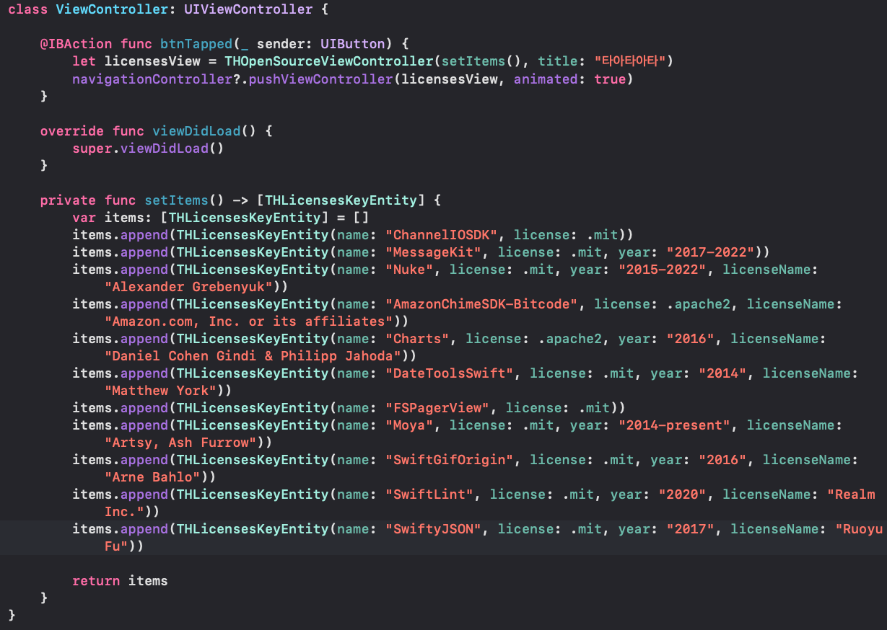

# THOpensourceViewController
#### Super Easy License View.

# Feature
- [x] pure swift 5.0 code

# Installation

#### Swift Package Manager
Simply add THSegmentControl to your `Package Dependancies`.

Add only url 'https://github.com/aboutyu/THOpenSourceViewController.git' into Package Dependancies

# Usage

You must create UIViewController and it add [THLicensesKeyEntity] array.

Then you must also move to THOpensourceViewController using navigationcontroller

You can see as below screen.



The following sample code for your reference.

```swift
import UIKit

class ViewController: UIViewController {

    @IBAction func btnTapped(_ sender: UIButton) {
        let licensesView = THOpenSourceViewController(setItems(), title: "오픈소스라이선스")
        navigationController?.pushViewController(licensesView, animated: true)
    }
    
    override func viewDidLoad() {
        super.viewDidLoad()
    }

    private func setItems() -> [THLicensesKeyEntity] {
        var items: [THLicensesKeyEntity] = []
        items.append(THLicensesKeyEntity(name: "ChannelIOSDK", license: .mit))
        items.append(THLicensesKeyEntity(name: "MessageKit", license: .mit, year: "2017-2022"))
        items.append(THLicensesKeyEntity(name: "Nuke", license: .mit, year: "2015-2022", licenseName: "Alexander Grebenyuk"))
        items.append(THLicensesKeyEntity(name: "Charts", license: .apache2, year: "2016", licenseName: "Daniel Cohen Gindi & Philipp Jahoda"))
        items.append(THLicensesKeyEntity(name: "DateToolsSwift", license: .mit, year: "2014", licenseName: "Matthew York"))
        items.append(THLicensesKeyEntity(name: "FSPagerView", license: .mit))
        items.append(THLicensesKeyEntity(name: "Moya", license: .mit, year: "2014-present", licenseName: "Artsy, Ash Furrow"))
        items.append(THLicensesKeyEntity(name: "SwiftGifOrigin", license: .mit, year: "2016", licenseName: "Arne Bahlo"))
        items.append(THLicensesKeyEntity(name: "SwiftLint", license: .mit, year: "2020", licenseName: "Realm Inc."))
        items.append(THLicensesKeyEntity(name: "SwiftyJSON", license: .mit, year: "2017", licenseName: "Ruoyu Fu"))
        
        return items
    }
}
```

# License

THOpensourceViewController is available under the MIT license. See the LICENSE file for more info.
